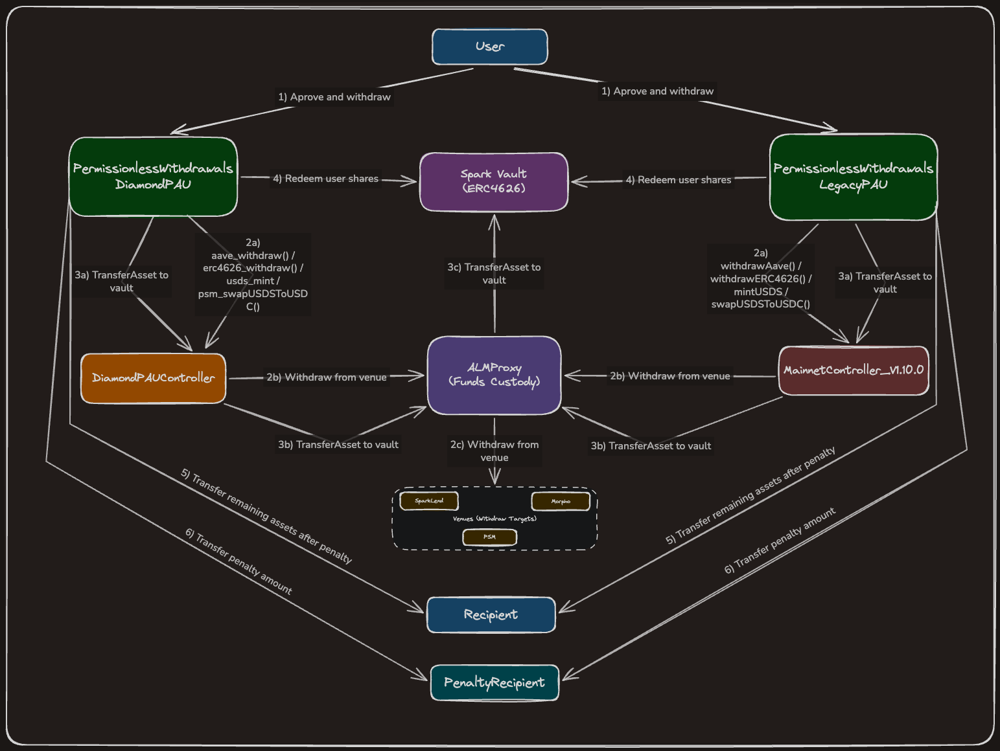

# Permissionless Withdrawals: Technical Design

## Objective

The ALM Planner is the normal path for moving liquidity in and out of Spark savings vaults. If it is unavailable, users could be unable to withdraw even when the underlying liquidity exists in SparkLend or other venues. This contract is a backup, a permissionless, single transaction path that sources a vault's missing liquidity straight from a hardcoded set of venues and hands it to the user, with no operator in the loop.

Anyone holding shares above the 24/7 liquidity level can call it. Supported venues are SparkLend (Aave style aTokens), generic ERC4626 vaults, and the PSM, covering USDC, USDT, and ETH.

## Withdrawal Flow

`permissionlessWithdraw(vault, venue, recipient, shares)` runs entirely inside a `nonReentrant` guard:

1. Validate that the vault and the `(vault, venue)` pair are whitelisted and that `recipient` is non zero.
2. Compute the shortfall. `assetsRequested = vault.convertToAssets(shares)`. Work out how much the vault is short, and from that how much the ALMProxy is short.
3. If the proxy is short, withdraw the difference from the venue into the proxy through the controller (Aave withdraw, ERC4626 withdraw, or PSM mint plus swap). A balance delta check enforces that the proxy actually received at least the requested amount.
4. Transfer the shortfall from the proxy to the vault.
5. Redeem the caller's full `shares` from the vault to this contract.
6. Deduct the fixed per vault penalty, send it to the penalty recipient, and send the remainder to `recipient`.

The contract never holds funds between calls, assets only pass through during a single transaction.

The diagram below traces this flow for both the Diamond and Legacy implementations, including the venue withdrawal, the top up to the vault, and the recipient and penalty split.

## Design Choices

### Two controller implementations behind one base

Spark runs two MainnetController versions (a legacy one and the diamond/PAU one) whose function names differ. All of the logic above lives once in the abstract `PermissionlessWithdrawals`. The four controller interactions (`_transferAsset`, `_withdrawAave`, `_withdrawERC4626`, `_withdrawPSM`) are `virtual` hooks. The PSM path is a single `_withdrawPSM` hook that mints USDS and swaps it to the gem internally. `PermissionlessWithdrawalsLegacyPAU` and `PermissionlessWithdrawalsDiamondPAU` each implement only those hooks against their controller's ABI. The same test suite runs against both, so behaviour stays identical across versions.

The controller is set once in the constructor as an `immutable` and has no setter. The `proxy` is derived from it there too, so neither can change after deployment. Switching implementations is therefore a separate deployment, not an in-place upgrade. Initially the\ `PermissionlessWithdrawalsLegacyPAU` will be deployed, then `PermissionlessWithdrawalsDiamondPAU` separately once the diamond controller is live.

### ERC4626 venue slippage bounded by a per venue ratio

When withdrawing from an ERC4626 venue, the contract caps the shares burned at `maxSharesIn = amount * maxSharesInRatio / 1e18`, with `maxSharesInRatio` set per venue by the admin through `setMaxSharesInRatio`. This bounds slippage on the withdraw path, which the controller does not guard itself (unlike its deposit and redeem paths, it applies no `maxExchangeRate` check).

- The caller is permissionless and untrusted, so the bound cannot come from the caller. Anchoring it to a per venue admin ratio keeps the caller out of the slippage decision.
- The ratio must encode both the slippage headroom and the asset to share decimal gap, `10**(shareDecimals - assetDecimals)`. `1e18` is `1:1` only when the decimals match, a 6 decimal asset against an 18 decimal share vault needs `1.1e18 * 1e12` for 10% headroom.
- The ratio defaults to zero, so an unconfigured venue yields `maxSharesIn = 0` and every withdrawal through it reverts. The path is fail closed, a venue is unusable until its ratio is set.

### PSM conversion assumes a USDC gem

The PSM path mints USDS and swaps it to the gem using a hardcoded `_USDS_CONVERSION_PRECISION = 1e12` defined in each concrete implementation, which assumes a 6 decimal gem against 18 decimal USDS. This is safe only because the PSM gem is permanently USDC. The controller reads this factor from the PSM at call time, but this contract relies on the invariant rather than reading it.

### Venue whitelisting and the incorrect venue guard

Vaults and venues are whitelisted by the admin per `(vault, venue)` pair, and the admin is trusted to whitelist correct venues. As a safety net, before drawing from a venue the contract checks that the venue's underlying asset matches the vault asset (`IncorrectVenue` otherwise). Two cases follow from where the check sits in the flow:

- If the vault and proxy already hold enough liquidity, no venue withdrawal is needed, the venue is never touched, and the withdrawal succeeds regardless of any misconfiguration on that venue.
- If a venue withdrawal is actually required and the configured venue is wrong, the asset check fails and the call reverts rather than pulling from the wrong venue.

So a misconfigured venue can never cause funds to be drawn from the wrong place, at worst it makes the backup path unavailable for vaults that genuinely need a top up from that venue.

### Fixed penalty

Each vault has a fixed penalty deducted from the redeemed assets and sent to the penalty recipient. It compensates for the cost of force unwinding ALM liquidity and keeps the permissionless path a backup rather than the default withdrawal route.

## Known Limitations

- Shared rate-limit budget. The backup path draws down the SLL's shared rate limits: the per venue withdraw keys consumed by the step 3 venue withdrawal, plus the per `(asset, vault)` `LIMIT_ASSET_TRANSFER` key consumed by the step 4 top up from the proxy to the vault. The PSM venue is special: a single PSM withdrawal mints then swaps, so it spends two global budgets in one call, the global `LIMIT_USDS_MINT` from the mint and the global `LIMIT_USDS_TO_USDC` from the swap. Any of these can be exhausted by normal SLL activity or griefed through repeated calls, in particular repeated PSM withdrawals can stall unrelated SLL operations that share `LIMIT_USDS_MINT` or `LIMIT_USDS_TO_USDC`. The fixed penalty per call and the limits regenerating over time are the mitigations.

- Per vault transfer limit must be provisioned. The step 4 top up calls `_transferAsset(asset, vault, amount)`, which the controller meters under `makeAddressAddressKey(LIMIT_ASSET_TRANSFER, asset, vault)`. Whitelisting a vault does not by itself make the backup path usable: if that key is left at its default of zero, every call that needs a top up reverts and the path is dead for that vault. The governance spell that whitelists a vault must also raise this rate limit, alongside the relevant venue withdraw keys, high enough to cover the expected backup withdrawals.

- ERC4626 venue setup is two steps. Whitelisting an ERC4626 venue with `setVenueType` does not make it usable on its own: `setMaxSharesInRatio` must also be called for that venue. The two calls are uncoupled and unvalidated, so an unset ratio leaves `maxSharesIn` at zero and every withdrawal through that venue reverts. A governance spell adding an ERC4626 venue must set its ratio in the same spell.

## Trust Assumptions

- `DEFAULT_ADMIN_ROLE` (Spark governance, `SPARK_PROXY`): fully trusted. Whitelists vaults and venues, sets penalties and penalty recipient, and sets per venue max shares in ratios.
- Supported assets must be standard, non-rebasing, non-fee-on-transfer ERC-20s. USDT is in scope and has a dormant fee switch that, if enabled, would break the exact penalty plus recipient amount split.
- MainnetController, ALMProxy, and RateLimits: trusted to custody funds and enforce rate limits and slippage. This contract must hold the controller's relayer role (legacy `RELAYER`, diamond `ALLOCATOR_ROLE`), granted by a governance spell, in order to drive the ALMProxy.
- Callers: untrusted and permissionless. A caller can only redeem their own shares (which they must have approved to this contract) and always pays the penalty.
